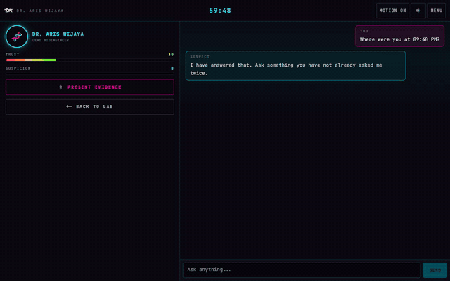

<h1 align="center">CYBERPUNK LAB 404</h1>

<p align="center">
  An AI-driven murder mystery escape room.<br/>
  One body, four suspects, sixty minutes of air.
</p>

<p align="center">
  
  
  
  
  
</p>



Dr. Kenji Rahman flatlined in Lab 404 at 09:47 PM. The lab sealed itself
behind him. You have an hour of oxygen to work out who did it, or to find the
airlock code and leave. Four characters are on the other side of every
question, each one a language model running a persona: a tone, a set of
tics, a false alibi, a secret, and rules for how much trust it takes before
they let any of that slip.

There is no dialogue tree. You type whatever you want, and a second model
scores what the exchange did to their trust in you and their suspicion that
you are dangerous.

For the full write-up with every screen, design notes and the problems that
came up building it, see [`progress.md`](progress.md).

---

## Quick start

```bash
git clone git@github.com:yizhiwan/test-game.git
cd test-game
npm install
npm run dev
```

Open **http://localhost:3000** and click **Initiate Investigation**.

That's it — the game is fully playable with no further setup. Without an API
key, suspects answer with a rotation of in-character fallback lines instead
of live model replies, but every other system runs exactly as designed:
evidence gating, trust and suspicion, alibis breaking, lockouts, and all four
endings.

## Playing with live AI dialogue

To have the suspects actually respond to whatever you type, add a free
[Google Gemini API key](https://aistudio.google.com/apikey) — no credit card
needed:

```bash
cp .env.example .env.local
```

Edit `.env.local`:

```bash
GOOGLE_GENERATIVE_AI_API_KEY=...
```

Restart `npm run dev`. Dialogue now streams from Gemini, and a second,
cheaper model scores each exchange to move trust and suspicion.

The provider is isolated to [`lib/models.ts`](lib/models.ts) — the API routes
never import it directly, so swapping to Anthropic, Groq, or a local Ollama
server is a matter of changing that one file.

## How to play

1. **Search the lab.** Click the five glowing nodes: the body, the
   workbench, the terminal, the vent, the observation window. Some are
   locked until something else has been found first.
2. **Follow the evidence.** Each clue you pick up unlocks a new character
   willing to talk to you.
3. **Interrogate.** Click a suspect's portrait to open the conversation.
   Ask anything. Their trust in you and their suspicion of you move
   independently, and both are visible as meters.
4. **Present evidence.** Mid-interrogation, put a clue on the table. Show
   the right suspect the right thing and their alibi can break outright.
   Show the wrong suspect the wrong thing and it costs you.
5. **Decide how it ends**, at the terminal:
   - Enter the airlock code to escape.
   - Name a killer. Naming the right one is not enough on its own — you
     need the evidence in hand to make it stick.

Sixty minutes of in-game oxygen run on the timer at the top of the screen.
Running it out ends the case on its own.

---

## Tech stack

| Layer | Choice |
| --- | --- |
| Framework | Next.js 15 (App Router), React 19, TypeScript |
| Styling | Tailwind CSS 3, custom CRT/neon effects in plain CSS |
| State | Zustand, three stores, each persisted to `localStorage` |
| Motion | Framer Motion for interaction, CSS for anything that gates visibility |
| AI | Vercel AI SDK v7 + Google Gemini (free tier) — one model for dialogue, a cheaper one for scoring |
| Audio | Howler, with a WebAudio synth fallback when no audio files are present |
| Mobile shell | Capacitor, for an Android build of the static export |

## Project layout

```
app/                  routes (title, lab, interrogation, terminal, endings)
app/api/npc/          edge routes: chat (streaming dialogue) and evaluate (scoring)
components/           room, interrogation, terminal and overlay UI
stores/               gameStore, npcStore, uiStore — persisted Zustand state
hooks/                dialogue streaming, store hydration, motion preference
lib/                  case data, suspect personas, fallback lines, audio, model ids
scripts/              capacitor build helper, portfolio screenshot/video capture
```

## Other scripts

```bash
npm run build          # production build
npm run typecheck      # tsc --noEmit
npm run build:capacitor # static export for the Android shell (see progress.md)
npm run capture         # regenerate the screenshots and clip used in progress.md
```

## Status

Working end to end. Both the web build and the Capacitor static export pass,
and all four endings have been played through in a browser, including the
timer running out and redirecting on its own. Live dialogue has only been
exercised against the fallback path so far, since testing hasn't used a real
API key. No audio files ship yet — drop some into `public/audio` (see the
`README.md` there) and Howler picks them up automatically.

---

<p align="center"><sub>v1.0 · Built with Claude Code</sub></p>
