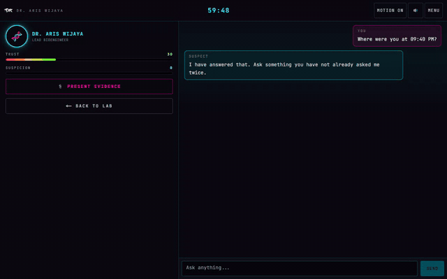
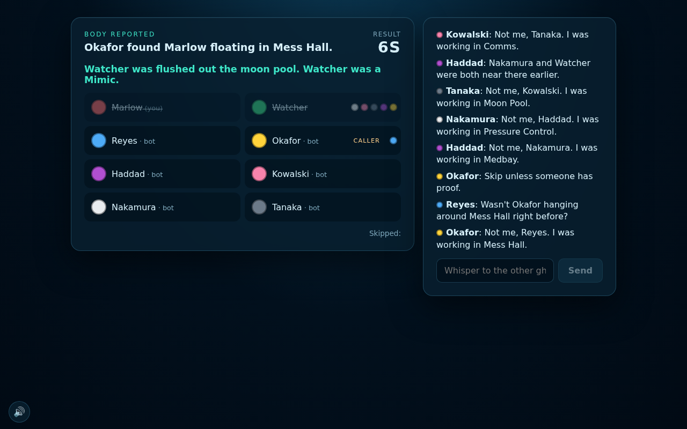
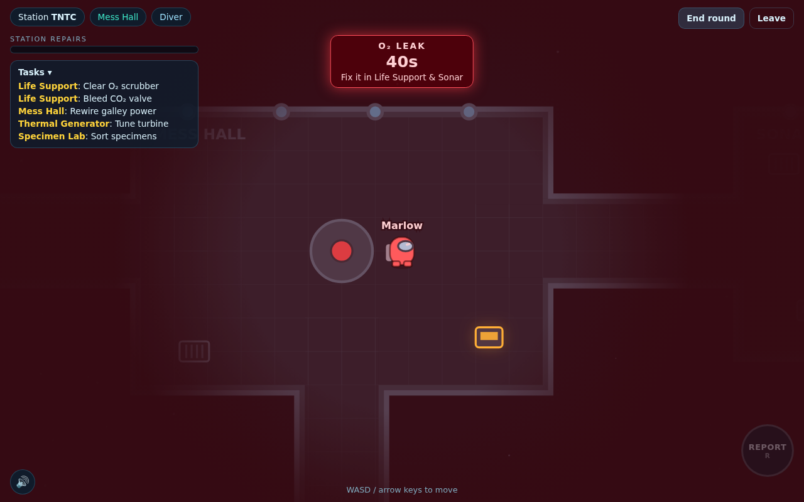
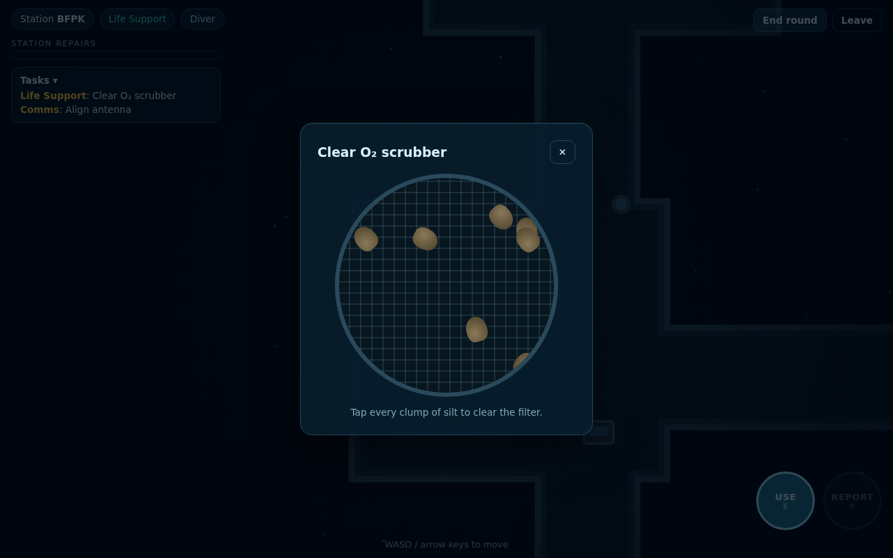
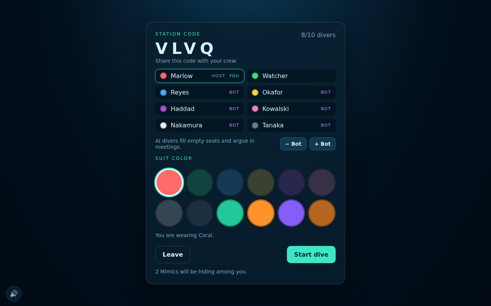

# test-game

A collection of browser games built around AI characters. Each game lives in
its own folder under [`games/`](games) with its own dependencies, Dockerfile
and README, so they build and deploy independently.

## Games

### Cyberpunk Lab 404

An AI-driven murder mystery escape room. One body, four suspects, sixty minutes
of air. Every suspect is a language model running a persona with an alibi, a
secret and rules for how much trust it takes before they slip. There is no
dialogue tree: you type whatever you want.



**Stack:** Next.js 15 · React 19 · Tailwind · Zustand · Vercel AI SDK + Gemini ·
Capacitor (Android) · [Read more →](games/cyberpunk-lab-404)

### Abyss Station

An Among Us-style multiplayer social deduction game on a research base 3,800 m
down a trench. Divers repair the station. Mimics wearing crewmates' faces pick
them off. Play with friends by room code, or fill the seats with AI bots that
do tasks, hunt, sabotage, and argue (and lie) in meetings.

| Meeting with AI bots | O₂ leak sabotage |
|---|---|
|  |  |
| **Task mini-game** | **Lobby filled with bots** |
|  |  |

- Real-time multiplayer: authoritative 30 Hz Socket.IO server, client-side
  prediction and interpolation, keyboard and touch controls
- Roles, kills, ghosts, body reports, emergency meetings with chat and voting
- 5 task mini-games, 3 sabotages (lights, O₂, hull breach) and vents
- Server-enforced secrecy: each player only receives what their helmet lamp
  can see, so reading network traffic reveals nothing
- AI bots that play fair, using the same filtered view and server checks as
  humans, with meeting dialogue from Gemini

**Stack:** Vite · React 19 · Canvas 2D · Express · Socket.IO · Web Audio ·
Vercel AI SDK + Gemini · [Read more →](games/abyss-station)

## Quick start

Requires Node.js 20+.

```bash
git clone https://github.com/yizhiwan/test-game.git
cd test-game
npm run install:all
```

| Game | Run | Open |
|---|---|---|
| Cyberpunk Lab 404 | `npm run dev:lab404` | http://localhost:3000 |
| Abyss Station | `npm run dev:abyss` | http://localhost:5173 |

Both games are fully playable without any keys. To turn on live AI dialogue,
add a free [Gemini API key](https://aistudio.google.com/apikey) to the game's
env file (`.env.local` for Lab 404, `.env` for Abyss Station). Each game has a
`.env.example` to copy.

**Playing Abyss Station solo:** click **Play vs bots** on the title screen. It
drops you into a round with five AI divers, one of whom is a Mimic.

## Scripts

Run from the repo root:

| Script | What it does |
|---|---|
| `npm run install:all` | Install dependencies for every game |
| `npm run dev:lab404` / `npm run dev:abyss` | Start a game's dev server |
| `npm run build:lab404` / `npm run build:abyss` | Production build |
| `npm run typecheck:lab404` / `npm run typecheck:abyss` | Type-check |

## Repository layout

```
games/
  cyberpunk-lab-404/   Next.js app: detective escape room with LLM suspects
  abyss-station/       Vite client + Socket.IO server: multiplayer social deduction
    shared/            map, physics, protocol and rules shared by client and server
    server/            game rooms, bots (server/bots) and Gemini meeting talk
    src/               React screens, Canvas renderer, mini-games, sound
package.json           shortcuts that run each game's own scripts
```

## Deploying

Each game has a Dockerfile and deploys on its own. The two have different needs:

- **Cyberpunk Lab 404** is a Next.js app with two API routes, so it runs on
  Vercel, or as a container on Cloud Run.
- **Abyss Station** needs a long-running server that holds WebSocket
  connections, so it **can't run on Vercel, Netlify or GitHub Pages**. Use a
  container host such as Google Cloud Run, Render, Railway or Fly.io. Game
  rooms live in memory, so run a single instance:

```bash
cd games/abyss-station
gcloud run deploy abyss-station --source . \
  --allow-unauthenticated \
  --max-instances 1 --session-affinity \
  --timeout 3600 \
  --set-env-vars GOOGLE_GENERATIVE_AI_API_KEY=your-key   # optional
```

`--timeout 3600` matters: Cloud Run closes WebSocket connections at the request
timeout, and the 5-minute default is shorter than a round.

## Adding a game

1. Create `games/<name>/` as a self-contained app with its own `package.json`
   (and a Dockerfile if it deploys as a container).
2. Add `dev:<name>`, `build:<name>` and `typecheck:<name>` scripts to the root
   `package.json`, and add it to `install:all`.
3. Add it to the **Games** section above.
