# Cyberpunk Lab 404

An AI-driven murder mystery escape room. One body, four suspects, sixty minutes
of air. Every suspect is a language model running a persona prompt, so the
interrogation is genuinely open-ended: you type whatever you want, and a second
model scores what the exchange did to their trust and their suspicion of you.

**Stack:** Next.js 15 (App Router) · React 19 · TypeScript · Tailwind 3 ·
Zustand · Framer Motion · Vercel AI SDK v7 · Anthropic Claude · Capacitor

---

## Gameplay clip


<video src="docs/media/gameplay.mp4" controls loop muted playsinline width="800"></video>

A single run: search the workbench, force the vent, interrogate Dr. Aris
Wijaya, then put the encrypted drive on the table and watch his alibi come
apart.

The clip ships in three formats, since no single one works everywhere.
[MP4](docs/media/gameplay.mp4) is the one to embed on a site or upload to a
social post. [WebM](docs/media/gameplay.webm) is the original recording. The
GIF above is the last ten seconds only, sized for a README, where video cannot
be embedded at all.

| File | Size | Length | Use |
| --- | --- | --- | --- |
| `gameplay.mp4` | 1.3 MB | 27s | Portfolio site, LinkedIn, Twitter |
| `gameplay.webm` | 2.1 MB | 27s | Original recording |
| `gameplay.gif` | 0.8 MB | 10s | README, chat, anywhere video is blocked |

---

## The case

Dr. Kenji Rahman flatlined in Lab 404 at 09:47 PM. The lab sealed itself. You
have an hour of oxygen to work out who did it, or to find the airlock code and
leave.

The timeline the whole case hangs on:

| Time     | Event                                                        |
| -------- | ------------------------------------------------------------ |
| 09:40 PM | Someone badges into Lab 404 on a level-3 card                 |
| 09:46 PM | The camera feed is wiped with that same card                  |
| 09:47 PM | Kenji's vitals stop                                           |

The card belonged to the victim. Whoever used it was still using it after he
was dead.

---

## Screens

### Title

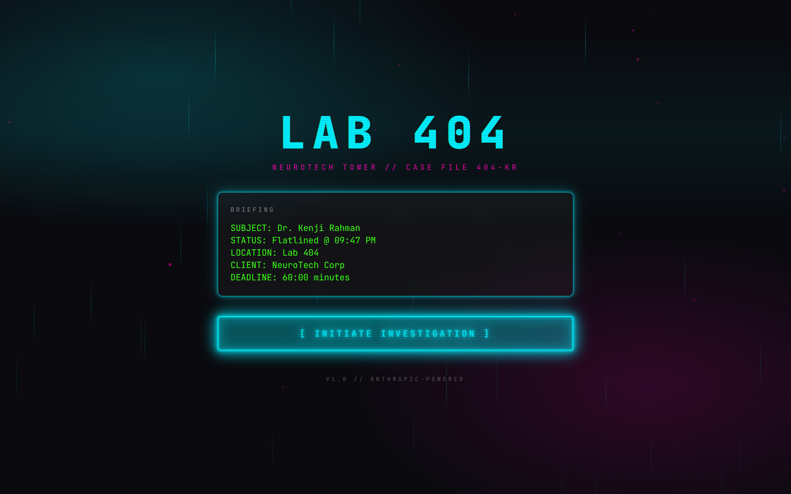

Glitching header, rain streaks and drifting particles in CSS, and a case
briefing that types itself in. Rain positions come from an index-seeded
generator rather than `Math.random`, so the server and client render identical
markup and hydration stays clean.

### The lab

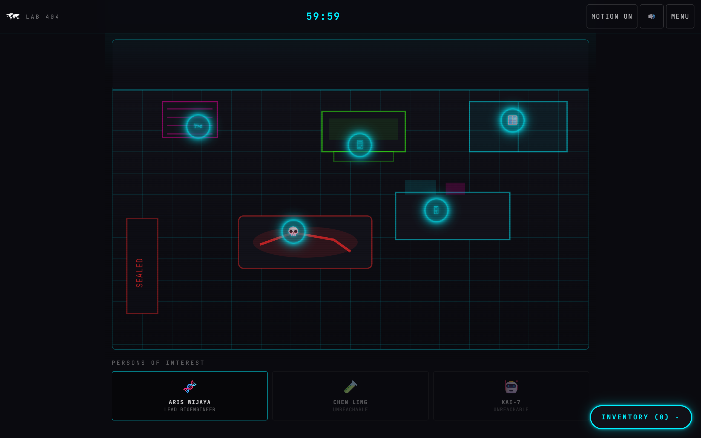

The room is hand-drawn SVG geometry rather than art assets. Five hotspots sit
on top of it as pulsing neon nodes. The clock in the top bar bills elapsed
wall-clock time rather than counting interval fires, so backgrounding the tab
does not quietly hand you extra minutes.

### Gated progression

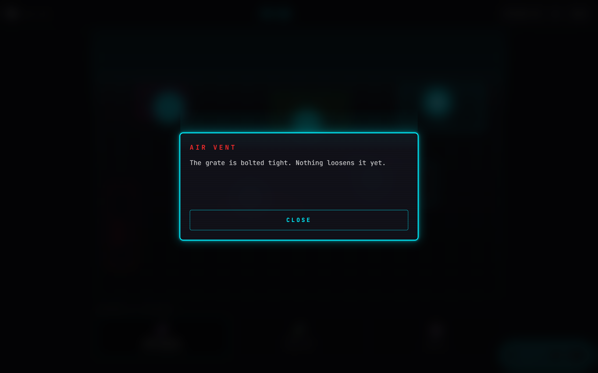

The vent is bolted until you have found the keycard on the workbench. The store
owns that rule, not the view; the component only reports the verdict.

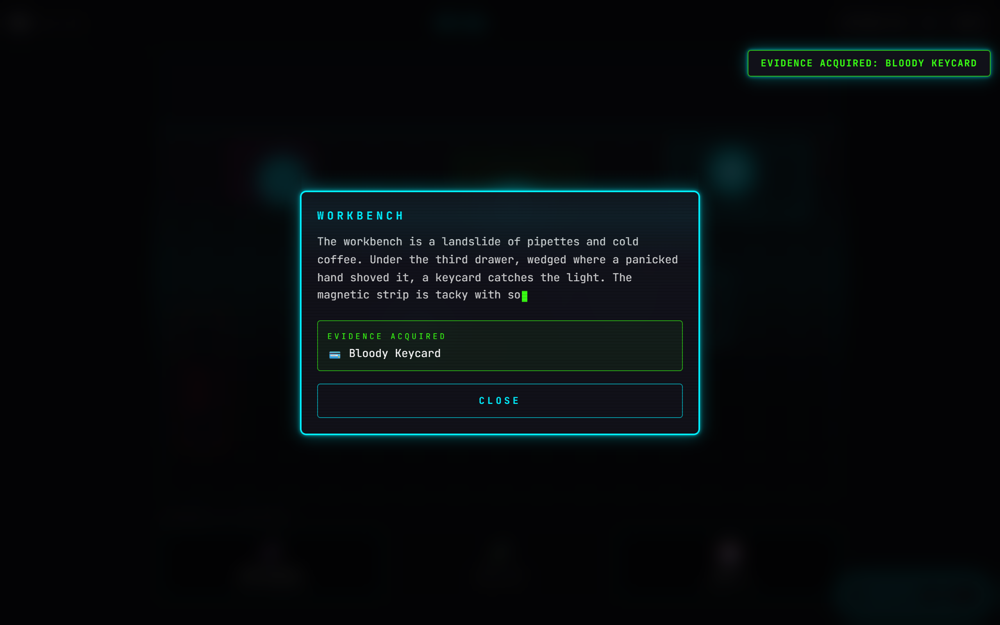

Searching the workbench yields the bloody keycard, which in turn unlocks the
security bot as someone you can question.

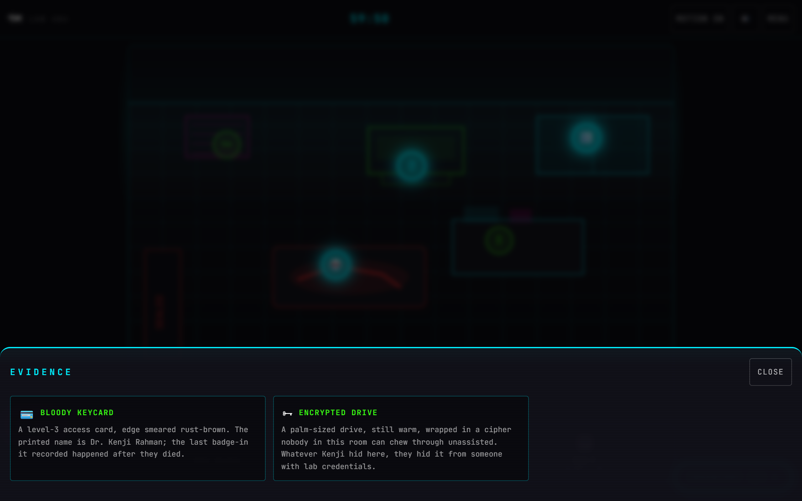

### Interrogation

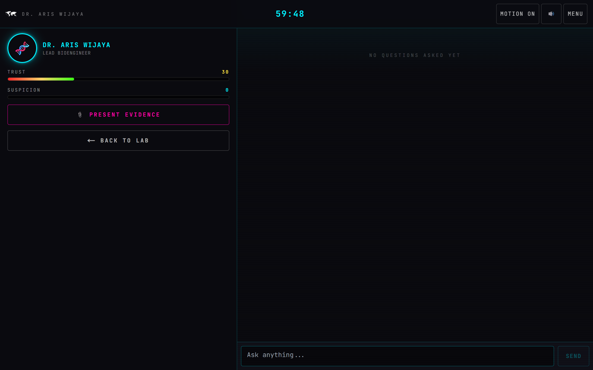

Each suspect carries a full persona prompt: voice, tics, a false alibi, a
secret, and a five-band trust ladder that changes how much they will give you.
Trust and suspicion are separate meters, and they do not move together.

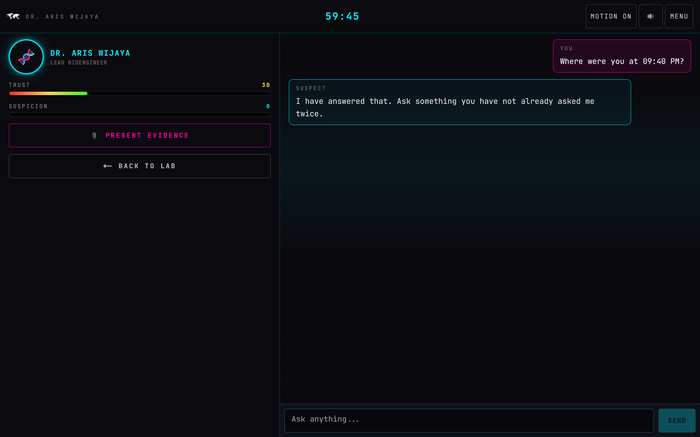

Replies stream token by token into the transcript.

### Presenting evidence

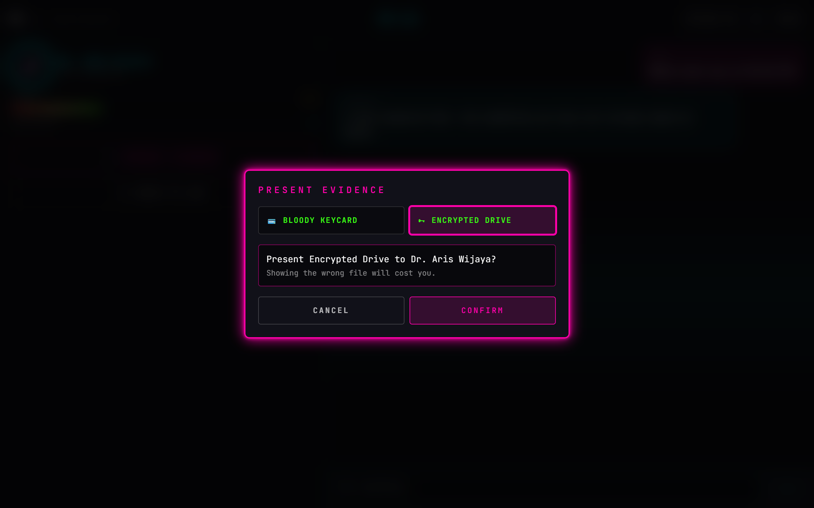

Two steps on purpose. Putting the wrong file in front of a suspect costs you
trust and raises their suspicion, so the commitment should be felt.

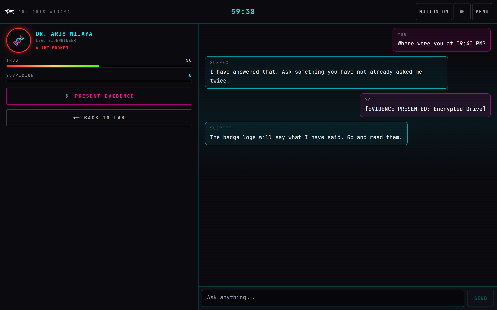

The encrypted drive is the one that lands. His alibi breaks, the portrait tears
itself up, trust jumps, and the airlock code drops into your inventory.

### Terminal and endings

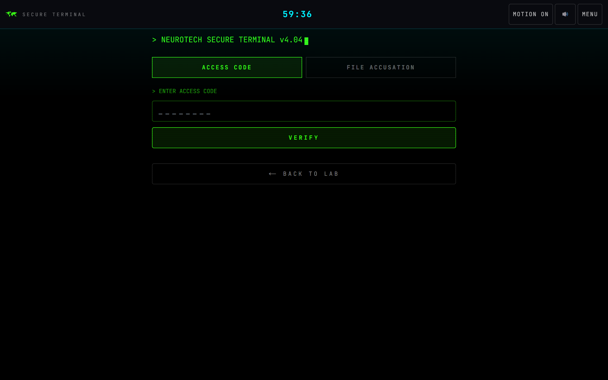

Two ways out. Enter the airlock code and leave, or name the killer. Naming the
right suspect is not enough on its own; the accusation only sticks if you are
holding the evidence to carry it.

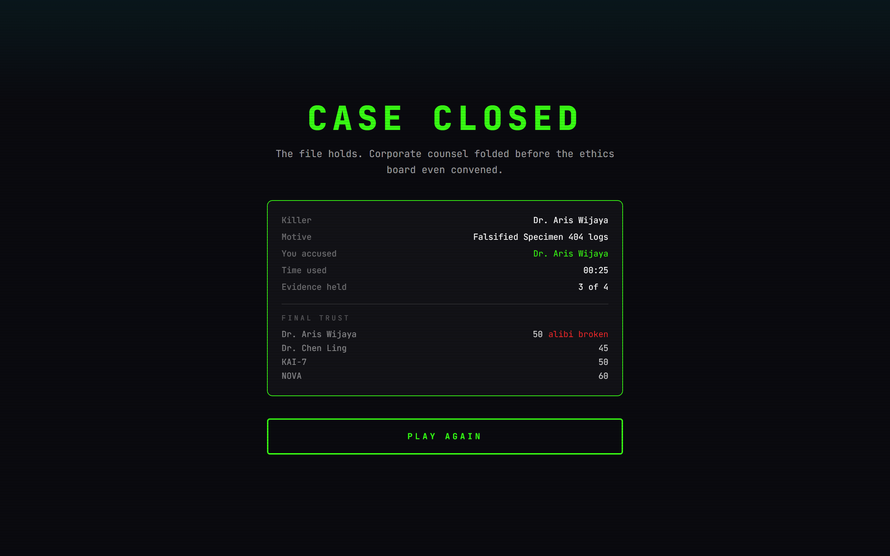

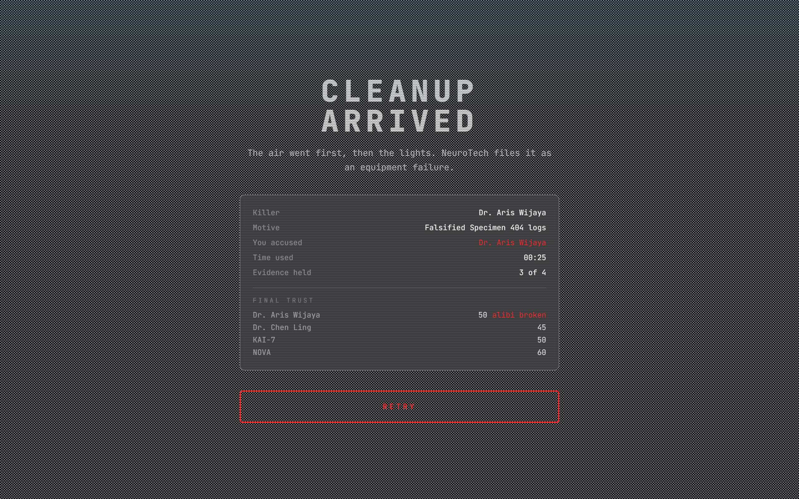

Four endings: convict, escape, accuse the wrong person, or run out of air.

### Mobile

| Title | Lab | Interrogation |
| --- | --- | --- |
| 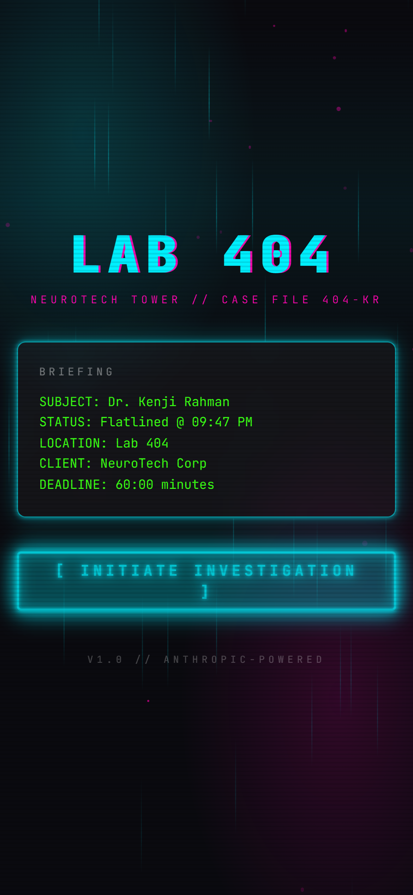 | 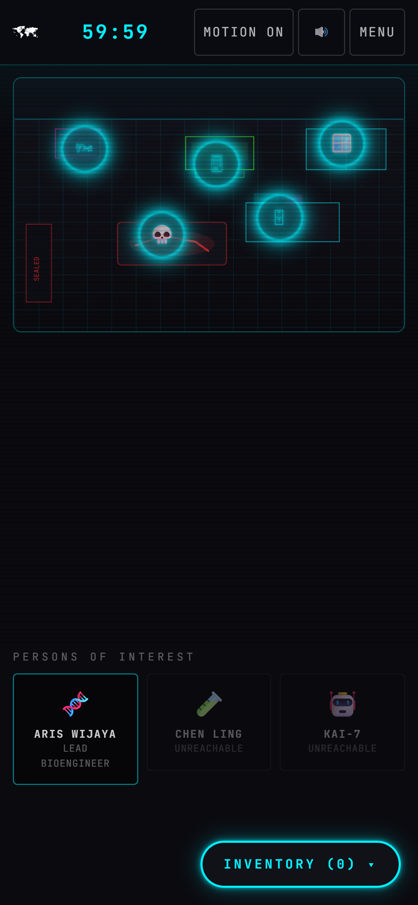 | 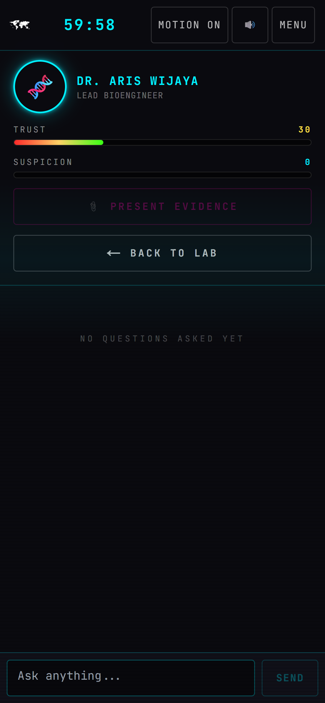 |

The interrogation splits 40/60 on desktop and stacks on mobile. Touch targets
are 44px minimum throughout.

---

## How it is put together

**Three Zustand stores, each persisted to localStorage.** `gameStore` holds the
run: phase, inventory, examined hotspots, the clock, the ending. `npcStore`
holds per-suspect trust, suspicion, transcript, revealed clues and lockout
state. `uiStore` holds overlays and preferences. All three defer hydration, so
the first client render matches the server byte for byte and reads localStorage
afterwards.

**Two models, two jobs.** A larger model plays the characters; a small fast one
scores each exchange and returns a fixed-shape object through a Zod schema:
trust delta, suspicion delta, revealed clue, emotional state, alibi broken.
Running the cheap model on every turn keeps the scoring loop affordable.

**The critical path is not left to the model.** Two outcomes are decided in
code: showing the drive to the killer always breaks him and always yields the
code, and showing evidence to a suspect it does not implicate always costs you.
A model that has an off day cannot make the case unsolvable.

**A dead API must not read as a dead character.** Every suspect keeps a small
rotation of in-voice deflections. If the model call fails, they deflect in
character and the turn costs the player nothing but time.

---

## Problems worth writing down

**Animations that hide content.** Every entry animation was Framer Motion, so
elements began at `opacity: 0` and only became visible once the animation ran.
In a browser where `requestAnimationFrame` had stalled, the start button never
appeared at all. Since an Android WebView stalls frames the same way, all entry
and overlay animations moved to CSS, which is compositor-driven and finishes
regardless. Framer Motion still drives interaction, where frames are
guaranteed.

**Reduced motion, done properly.** The OS preference cannot be read during the
first render, because the server has no media queries and branching on it
breaks hydration. The first render honours only the in-game toggle; the system
preference folds in after mount.

**Static export versus API routes.** Capacitor needs a static bundle, and a
static bundle cannot host route handlers. The dynamic routes were also client
components, which cannot declare `generateStaticParams`, so each was split into
a thin server shell and a client view. A build script moves the API directory
aside for the export and restores it afterwards, copying rather than renaming
because a synced folder will refuse the rename.

---

## Status

Working end to end. Both builds pass and all four endings have been played
through in a browser, including the timer running out and redirecting on its
own.

Two things are not finished. Live dialogue has only been exercised against the
fallback path, not a real API key. And there are no audio files: the sound layer
synthesizes short tones through WebAudio, and drops in real ones the moment
they are added to `public/audio`.

---

## Running it

```bash
npm install
npm run dev
```

Live dialogue needs an Anthropic API key in `.env.local`. Without one the game
is still fully playable on the fallback path.

```bash
ANTHROPIC_API_KEY=sk-ant-...
```

Regenerate every screenshot and clip in this document. Run it against a
production server, not the dev server, or the Next.js dev badge lands in the
corner of each shot. It drives your installed Chrome, so no browser gets
downloaded, and it re-encodes the MP4 and GIF if ffmpeg is on your PATH.

```bash
npm run build && npx next start -p 3100
```

```bash
npm run capture -- http://localhost:3100
```
